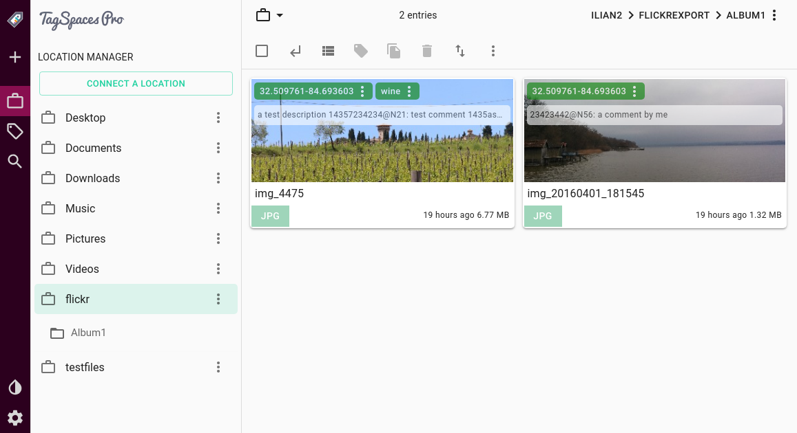

# Flickr Export Organizer
This script will organize the files exported from the Flickr service in folders, trying to extract tags and other meta data.

## Motivation
According to the recent announcement from Flickr, the free users will lose most of their photos in they don't want to update to a paid plan. Thankfully Flickr is providing a way to export all of your photos and videos together with some meta data including useful things such as tags and albums. The purpose of this script is to extract that data and saved in format, which can be later recognized by our open source file management software [TagSpaces](https://github.com/tagspaces/tagspaces). The script iterates thought all the media files in the export folder and copies the found files in folders. If file is part of album, a folder with the album's name is create and the file is copied there. If this is not the case the script create a folder, which name corresponds to the date when the image was taken, and copies it there.

## Prerequirements
- Node.js - you will need a running Node.js environment, which can be easily achieved on Windows, macOS or Linux by just installing Node.js from https://nodejs.org/en/download/

- Your Flickr Data - You have to request and download your Flickr data, as shown in following screenshot.
  * Login to Flickr via the web
  * Click on the profile avatar and then select Settings
  * Go to "Your Flickr Data" area and request your files by clicking the "Request my Flickr data".
  * After a while the data is prepared and you have to download all the zip-files locally.

.


## Installation and running

- Create a folder where the script will run.

- Download the last version of the script directly from [here](https://raw.githubusercontent.com/tagspaces/flickr-export/master/export-organizer.js) or from the [release section](https://github.com/tagspaces/flickr-export/releases) of this project.

- Extract all files from all zip exports in a  sub folder called `flickerData`.

- Under Windows you can right click on flickr-export.js and choose Open With... (path_to_nodejs\node.exe)

- Alternatively you can run the script in a Windows, Linux or macOS terminal like this:

```
node export-organizer.js
```

## Resulting structure

The folder structure before running the script should look like this:

    ~ your working folder
    ├── flickrData
    │   ├── img_4376_2723423425_o.jpg - image part of Album1
    │   ├── photo_2723423425_o.json
    │   ├── img_20180823_2723427625_o.jpg - image taken on 2018-08-23
    │   ├── photo_2723427625_o.json
    │   ├── ...    - other media files
    │   ├── albums.json
    │   └── ...    - other profile json files
    └── export-organizer.js

After running the script, you will have the following folder structure:

    ~ your working folder
    ├── flickrData
    │   ├── img_4376_2723423425_o.jpg - image part of Album1
    │   ├── photo_2723423425_o.json
    │   ├── img_20180823_2723427625_o.jpg - image taken on 2018-08-23
    │   ├── photo_2723427625_o.json
    │   ├── ...    - other media file
    │   ├── albums.json - file containing your albums
    │   └── ...    - other profile json files
    ├── flickrExport
    |   │   ├── Album1
    |   │   |   ├── .ts
    |   │   |   |   ├── img_4376.jpg.json
    |   │   |   |   └── ... other TagSpaces meta data files
    |   │   |   ├── img_4376.jpg
    |   │   |   └── ... other media files
    |   │   └── 20180823
    |   │       ├── .ts
    |   │       |   ├── img_20180823.jpg.json
    |   │       |   └── ... other TagSpaces meta data files
    |   │       ├── img_4376.jpg
    |   │       └── ... other media files
    │   └── ... - other profile json files
    └── export-organizer.js

## Managing your files with TagSpaces

After the the files are organized. You can create a new location in TagSpaces pointing to the `flickrExport` folder and open it. Now you will be able to navigate your photos in TagSpaces by albums and see the tags you gave to your media files.



Your don't need of course TagSpaces for just browsing your photos by folders, but if you have spend some time organizing your photos with tags, descriptions and comments, [TagSpaces](https://www.tagspaces.org) might be helpful.

## Licensing

This script is published under the [MIT license](LICENSE).
